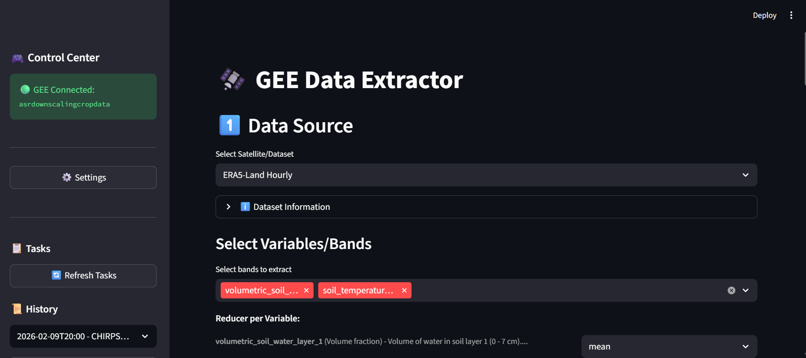

# 🌍 GEE Data Extractor UI — Google Earth Engine Satellite Data Extraction Tool

[](https://www.python.org/downloads/)
[](https://streamlit.io/)
[](https://earthengine.google.com/)
[](https://opensource.org/licenses/MIT)

A **no-code Streamlit dashboard** for extracting historical satellite and climate datasets from **Google Earth Engine (GEE)** — without writing a single line of JavaScript or Python. Built for researchers, GIS analysts, remote sensing specialists, and data scientists who need fast, reproducible access to environmental data such as NDVI timeseries, ERA5-Land climate reanalysis, and CHIRPS precipitation records.

---

**[Overview](#-overview)** · **[Features](#-key-features)** · **[Datasets](#-supported-datasets)** · **[Installation](#️-installation)** · **[Usage](#-usage)** · **[Architecture](#️-technical-architecture)** · **[Roadmap](#-roadmap)** · **[Contributing](#-contributing)** · **[License](#-license)**

---

## 🚀 Overview



The **GEE Data Extractor UI** provides a complete end-to-end pipeline for acquiring complex environmental and satellite imagery data directly from Google Earth Engine — no manual coding required. Users can define their region of interest (ROI) visually, configure temporal filters, and submit high-volume extraction jobs to **Google Drive** or **local storage** in just a few clicks.

This tool is especially useful for:
- **Agricultural monitoring** (NDVI, EVI crop health analysis)
- **Climate research** (ERA5-Land temperature, wind, humidity)
- **Hydrological studies** (CHIRPS rainfall, GPM precipitation)
- **GIS automation** workflows requiring batch satellite data downloads

---

## ✨ Key Features

- **Intuitive No-Code GUI**: A polished Streamlit dashboard covering the full extraction workflow from ROI definition to download.
- **Flexible Region of Interest (ROI) Selection**:
  - **Point Coordinates**: Enter Lat/Lon coordinates directly.
  - **File Upload**: Import Shapefiles (`.shp`), GeoJSON, or KML geometries.
  - **Administrative Boundaries**: Country and province-level selection via **GADM** integration (`pygadm`).
- **Multiple Export Targets**: Export to **Google Drive** for large batch jobs or download results **locally** for quick samples.
- **Reproducibility & History**: Settings are persisted in `config/settings.toml`; full job history is tracked in `.cache/history.json` for instant parameter reloading.
- **Live Map Verification**: Automated geometry and map rendering to visually confirm your ROI before submitting a job.

---

## 🛰️ Supported Datasets

| Category | Dataset | Source |
|---|---|---|
| Vegetation Indices | NDVI & EVI | MODIS MOD13Q1 |
| Weather & Climate | Temperature, Wind, Humidity | ERA5-Land (Hourly & Daily) |
| Precipitation | High-resolution rainfall | CHIRPS Daily |
| Precipitation | Near-real-time global rain | GPM IMERG V07 (30-Min) |

> More datasets are planned — see the [Roadmap](#-roadmap).

---

## 🛠️ Installation

### Requirements

- **OS**: Windows, macOS, or Linux
- **Python**: 3.8 or higher
- **Google Earth Engine account** ([Sign up here — free for research](https://earthengine.google.com/signup/))

---

### 🪟 Windows — Quick Setup (Recommended, no terminal needed)

This is the easiest path and requires **no prior Python experience**.

1. **Clone or download** the repository.
2. **Double-click `run.bat`**.
   - On first run, it will automatically create a Python virtual environment and install all required dependencies.
   - On subsequent runs, it will simply activate the environment and launch the app.
3. **Authenticate with Google Earth Engine** (first time only) — a browser window will open automatically asking you to authorize access.

That's it. `run.bat` handles everything.

---

### 🐧🍎 macOS / Linux — Manual Setup

**1. Clone the Repository**
```bash
git clone https://github.com/Mastro1/GEE_data_extraction_UI.git
cd GEE_data_extraction_UI
```

**2. Create and activate a virtual environment**
```bash
python -m venv .venv
source .venv/bin/activate
```

**3. Install dependencies**
```bash
pip install -r requirements.txt
```

**4. Authenticate with Google Earth Engine** (first time only)
```bash
python -c "import ee; ee.Authenticate()"
```
Follow the browser prompt to authorize access. Your credentials will be cached locally.

---

## 📖 Usage

### Starting the Application

The easiest way is to use the provided launcher scripts, which handle environment setup automatically:

- **Windows**: Double-click `run.bat`
- **All platforms**: Run `python run.py`

Alternatively, launch manually:

```bash
streamlit run src/interface/app.py
```

### Step-by-Step Workflow

1. **Configure Settings** — Use the sidebar to set your GEE Project ID and default download folders.
2. **Define WHAT** — Select your satellite dataset (e.g., ERA5-Land Daily) and the specific bands or variables you need.
3. **Define WHERE** — Enter point coordinates, upload a geometry file (Shapefile, GeoJSON, KML), or pick an administrative boundary using the GADM selector.
4. **Define WHEN** — Set your start/end date range and apply optional seasonal filters (e.g., extract only June–September).
5. **Verify** — Inspect the auto-rendered map to confirm your ROI is correct.
6. **Execute** — Click **Save to Drive** for large batch extractions or **Download Locally** for immediate results.

---

## 🏗️ Technical Architecture

The application follows a **Local State Architecture** to ensure responsiveness and reliability across sessions.

```
User Input (Streamlit UI)
        │
        ▼
  State Manager (settings.toml + history.json)
        │
        ▼
  GEE Python API Wrapper
        │
        ▼
  Google Earth Engine Servers
        │
   ┌────┴────┐
   ▼         ▼
Google     Local
 Drive    Storage
```

| Layer | Technology |
|---|---|
| Frontend (UI) | Streamlit |
| GEE Interface | `earthengine-api` (Python) |
| ROI Handling | `geopandas`, `pygadm` |
| Persistence | `settings.toml` + `.cache/history.json` |

---

## 📈 Roadmap

- [ ] **Expand Dataset Catalog** — Integrate Sentinel-2, Landsat-8/9, and additional climate products.
- [ ] **Spatial Masking** — Support for uploading and applying custom masks (e.g., crop masks, land cover layers) during extraction.
- [ ] **Full Session Restore** — Finalize "Reload Settings" to allow seamless recovery of complete previous work states.

---

## 🤝 Contributing

Contributions, bug reports, and feature suggestions are very welcome! This project is actively maintained and we appreciate community feedback.

To contribute:
1. **Fork** the repository and create a new branch (`git checkout -b feature/my-feature`).
2. **Make your changes** and ensure existing functionality is not broken.
3. **Open a Pull Request** with a clear description of what you changed and why.
4. **Report bugs** by opening a [GitHub Issue](https://github.com/Mastro1/GEE_data_extraction_UI/issues) with steps to reproduce.

---

## 📄 License

This project is licensed under the **MIT License** — see the [LICENSE](LICENSE) file for details.

---

*Developed with ❤️ for the Remote Sensing Community — [github.com/Mastro1](https://github.com/Mastro1)*
